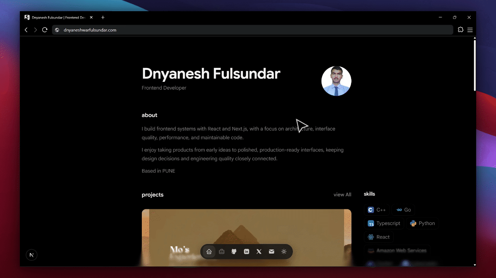

<p align="center">
  <a href="https://dnyaneshfulsundar.com">
    
  </a>
</p>

<h1 align="center">Personal Portfolio</h1>

<p align="center">
  <strong>Frontend developer building React and Next.js products.</strong>
</p>

<p align="center">
  <a href="https://dnyaneshfulsundar.com">Portfolio</a>
  ·
  <a href="https://www.linkedin.com/in/dnyaneshfulsundar/">LinkedIn</a>
  ·
  <a href="https://github.com/dnyanesh1011">GitHub</a>
  ·
  <a href="https://x.com/dnyanaa">X</a>
</p>

---

## About

This is my personal portfolio and writing site, built around frontend engineering, interface quality, and thoughtful product development.

I build frontend systems with React and Next.js, with a focus on architecture, interface quality, performance, and maintainable code.

I enjoy taking products from early ideas to polished, production-ready interfaces, keeping design decisions and engineering quality closely connected throughout the process.

Based in Maharashtra, India.

## What I built

### Personal homepage

The homepage brings together my identity, selected projects, technical skills, approach to frontend development, writing, social links, and contact information.

The content is driven through shared content records so information can be reused consistently across the site.

### Project archive and case studies

Projects are authored as MDX documents under [`content/projects`](./content/projects).

The project archive provides a compact overview of my work, while individual project pages provide more context around:

- the problem and starting point;
- product and interface decisions;
- implementation details;
- technologies used;
- the reasoning behind the final result.

### Writing surface

Technical writing lives under [`content/writing`](./content/writing) and follows the same MDX-backed content model.

The writing focuses on frontend engineering, React patterns, search and AI discovery, implementation decisions, and practical lessons from building software.

### Discovery and metadata

The project includes a dedicated metadata and discovery layer covering:

- route metadata;
- canonical URLs;
- Open Graph metadata;
- social preview images;
- JSON-LD structured data;
- sitemap generation;
- robots instructions;
- web manifest;
- `llms.txt`;
- `llms-full.txt`.

This keeps search, social sharing, and machine-readable discovery connected to the same content system.

### Interaction systems

The interface includes a collection of small interaction systems designed around orientation and feedback:

- floating navigation dock;
- project actions;
- article navigation;
- table of contents;
- theme controls;
- contact copy feedback;
- page transitions;
- subtle audio feedback;
- project technology highlighting.

The goal is not to add interaction for its own sake, but to make the interface feel responsive without competing with the content.

## Design principles

The project follows a few simple principles:

- **Clarity first** — communicate intent quickly.
- **Content over decoration** — let the work carry the interface.
- **Progressive disclosure** — reveal detail when it becomes useful.
- **Direct navigation** — keep important destinations easy to reach.
- **Shared systems** — solve recurring problems at the system level rather than through page-specific exceptions.
- **Restraint** — animation and visual effects should support the interface, not become the interface.

## Technology

| Layer | Technology |
| --- | --- |
| Framework | Next.js 16 App Router |
| UI | React 19 |
| Language | TypeScript 5 |
| Styling | Tailwind CSS 4 |
| Content | Fumadocs MDX |
| Animation | Motion |
| UI primitives | Base UI |
| Theme | `next-themes` |
| Audio | `@web-kits/audio` |
| Package manager | pnpm |

The project separates responsibilities across the codebase:

```text
app/          → routes and application entry points
components/   → reusable interface systems
content/      → authored projects and writing
lib/          → content, metadata, navigation, motion and design systems
public/       → static application assets
assets/       → GitHub README assets
spec/         → product direction and implementation notes
````

## Project structure

```text
.
├── app/
├── components/
├── content/
│   ├── projects/
│   └── writing/
├── lib/
├── public/
├── assets/
│   └── portfolio-preview.gif
├── spec/
├── package.json
└── README.md
```

## Run locally

Clone the repository and install dependencies:

```bash
pnpm install
```

Start the development server:

```bash
pnpm dev
```

The application will be available at:

```text
http://localhost:3000
```

## Validation

The repository includes formatting, linting, type checking, and production-build checks:

```bash
pnpm format:check
pnpm lint
pnpm typecheck
pnpm build
```

## Current project collection

The repository currently contains project pages for:

* Dana Doors
* Devloop
* Forge
* Markymap
* Mo's Experiences
* Reway
* Rootly

It also contains technical writing authored in MDX.

## Project notes

The product direction and implementation constraints are documented in [`spec/index.md`](./spec/index.md).

Session continuity and implementation notes live under [`spec/sessions`](./spec/sessions).

These documents keep product direction, writing tone, and implementation decisions close to the codebase so the portfolio can evolve without losing its underlying structure.

---

<p align="center">
  Edited by <a href="https://dnyaneshfulsundar.com">Dnyanesh Fulsundar</a>
</p>
